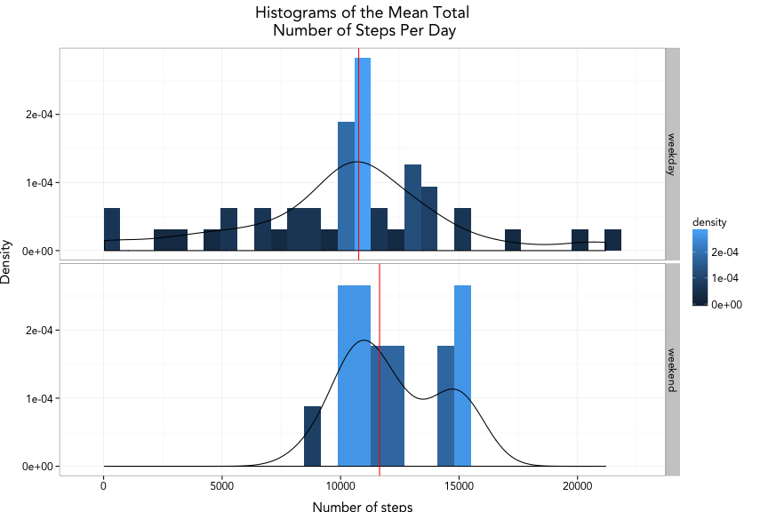
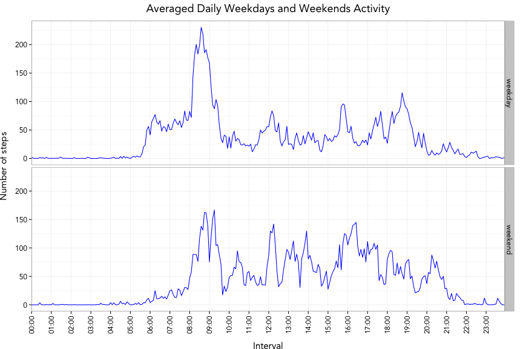

## 1 - Loading and preprocessing the data
This setups the libraries and loads the data from the zip file:

```r
library(dplyr)
library(lubridate)
library(ggplot2)
library(knitr)

rm(list=ls(environment()))
setwd("~/Documents/Coursera/repdata-033/RepData_PeerAssessment1")
opts_chunk$set(echo=FALSE, results="hold", message=FALSE, fig.width=7)

unzip("activity.zip","activity.csv")
data.activity <- read.csv(file="activity.csv", header=T, stringsAsFactors = F)
activity_tbl <- tbl_df(data.activity)
head(activity_tbl,3)
```

```
## Source: local data frame [3 x 3]
## 
##   steps       date interval
##   (int)      (chr)    (int)
## 1    NA 2012-10-01        0
## 2    NA 2012-10-01        5
## 3    NA 2012-10-01       10
```
  
Transforms the date variable from a character type  to a 'POSIXct' time format:

```r
activity_tbl$date <- ymd(activity_tbl$date)
head(activity_tbl,3)
```

```
## Source: local data frame [3 x 3]
## 
##   steps       date interval
##   (int)     (time)    (int)
## 1    NA 2012-10-01        0
## 2    NA 2012-10-01        5
## 3    NA 2012-10-01       10
```

Transforms the interval variable from an int to a 'HH:MM' character format:

```r
activity_tbl$interval <- sprintf("%04d",activity_tbl$interval)
activity_tbl$interval <- sapply(activity_tbl$interval,FUN=function(x) paste(strsplit(x, "(?<=.{2})", perl = TRUE)[[1]],collapse = ":"))
head(activity_tbl,3)
```

```
## Source: local data frame [3 x 3]
## 
##   steps       date interval
##   (int)     (time)    (chr)
## 1    NA 2012-10-01    00:00
## 2    NA 2012-10-01    00:05
## 3    NA 2012-10-01    00:10
```


## 2 - What is the mean total number of steps taken per day?
This code calculates the mean and median values to report:

```r
#--- grouping by date
total_steps_per_day_1 <- activity_tbl %>% group_by(date) %>% summarize(total_steps = sum(steps,na.rm=F)) 

#--- mean and median values to report
mean_total_steps_per_day_1 <- mean(total_steps_per_day_1$total_steps, na.rm=T)
median_total_steps_per_day_1 <- median(total_steps_per_day_1$total_steps, na.rm=T)
```

The mean total number of steps taken per day is <b>10766.2</b> steps/day.  
The median total number of steps taken per day is <b>10765.0</b> steps/day.  


This code creates the histogram showing the total number of steps taken each day:

```r
g <- ggplot(total_steps_per_day_1, aes(x=total_steps))
g <- g + geom_histogram(aes(y= ..density.., fill = ..density..))
g <- g + geom_density()
g <- g + geom_vline(xintercept = mean_total_steps_per_day_1, col="red")
g <- g + labs(x = "Number of steps") + labs(y = "Density")
g <- g + ggtitle("Histogram of the Mean Total\n Number of Steps Per Day")
g <- g + theme_bw(base_family = "Avenir", base_size = 12)
g <- g + theme(plot.title = element_text(size = rel(1.2),face="bold"))
g <- g + theme(axis.text = element_text(size = rel(0.7)))
plot(g)
```

 

 

## 3 - What is the average daily activity pattern?
The code below identifies the 5-minute interval in which there is the maximum number of steps (averaged accross all days):

```r
#--- grouping by interval and summarization with mean
five_min_avg_data <- activity_tbl %>% group_by(interval) %>% summarize(average_steps = mean(steps,na.rm=T))
five_min_avg_data$interval_minute <- lubridate::period_to_seconds(hm(five_min_avg_data$interval)) / 60

#--- retrieves the max number of step interval values to report
max_step_nb <- max(five_min_avg_data$average_steps)
max_step_interval_min <- five_min_avg_data$interval_minute[which.max(five_min_avg_data$average_steps)]
max_step_interval_str <- as.character(five_min_avg_data$interval[which.max(five_min_avg_data$average_steps)])
```

The maximum number of steps within a 5-minute interval is <b>206</b> (this value is averaged across all the days in the dataset).

The 5-minute interval which contains that maximum starts at the <b>515</b>th minute of the day at <b>08:35</b>.

  
  
The code below creates the time series plot of the 5-minute interval (x-axis) and the average number of steps taken, averaged across all days (y-axis):

```r
#--- Used for the axis labels
at_time_labels = as.character(five_min_avg_data[five_min_avg_data$interval_minute %in% seq(0,1440,by=60),]$interval)
at_min_labels = five_min_avg_data[five_min_avg_data$interval_minute %in% seq(0,1440,by=60),]$interval_minute
at_min_labels <- c(at_min_labels,1440)
at_time_labels <- c(at_time_labels,"24:00")

#--- Using Base Plot
par(mar=c(5, 5, 6, 5), oma=c(0, 0, 0, 0)) 
plot(x=five_min_avg_data$interval_minute, y=five_min_avg_data$average_steps, type="l", xaxt='n', xlab='', ylab='',  cex.axis=0.75, tck=-0.02, col="blue")
axis(1, at=seq(0,1440,by=60), labels=FALSE, tck=1, xlim=c(0,1440), col.ticks="gray90", lwd=0.5)
axis(1, at=seq(0,1440,by=60), labels=FALSE, tck=-0.02, xlim=c(0,1440), lwd=1)
text(x = seq(0,1440,by=60), par("usr")[3]-10, labels = at_time_labels, srt = 90, pos = 2, offset = 0, xpd = T, cex = 0.75)
axis(4, at=seq(0,200,by=50), labels=FALSE, tck=1, col.ticks="gray90", lwd=0.5)
axis(3, at=seq(0,1440,by=60), labels=FALSE,tck=-0.02, lwd=1)
text(x = seq(0,1440,by=60), par("usr")[4]+10, labels = at_min_labels, srt = 90, pos = 4, offset=0, xpd = T,  cex = 0.75)
abline(v=max_step_interval_min,col="red")
title("Averaged Daily Activity",xlab='5-min Intervals (top axis in minutes, bottom axis in hours)', ylab='Number of steps',cex.axis=0.5)
```

 


## 4 - Imputing missing values
Gets the number of rows with missing values:

```r
total_na_steps_rows_nb <- sum(is.na(activity_tbl$steps))
```
The dataset contain <b>2304</b> rows with missing values.  
  
  
My strategy for filling in all of the missing values in the dataset is to use the mean for that 5-minute interval distribution.

```r
#--- initialize the data table to fill in with missin values
filled_in_activity_tbl <- as.data.frame(activity_tbl)
for(i in seq(1:(nrow(filled_in_activity_tbl))))
{
  if(is.na(filled_in_activity_tbl[i,"steps"]))
  {
    #--- gets the corresponding interval value for that missing step value
    fill_interval <- unlist(filled_in_activity_tbl[i,"interval"])
    
    #--- retrieves the mean value from 'five_min_avg_data' calculate in previous section
    fill_step_value <- unlist(five_min_avg_data %>% filter(interval==fill_interval) %>% select(average_steps))
    
    #--- fills in the missing value for row i with the retrieved value
    filled_in_activity_tbl[i,"steps"] <- fill_step_value
  }
}
summary(filled_in_activity_tbl)
```

```
##      steps             date              interval        
##  Min.   :  0.00   Min.   :2012-10-01   Length:17568      
##  1st Qu.:  0.00   1st Qu.:2012-10-16   Class :character  
##  Median :  0.00   Median :2012-10-31   Mode  :character  
##  Mean   : 37.38   Mean   :2012-10-31                     
##  3rd Qu.: 27.00   3rd Qu.:2012-11-15                     
##  Max.   :806.00   Max.   :2012-11-30
```

This creates the histogram of the mean of the total number of steps taken each day after imputing missing data:  

```r
#--- grouping by date and summarizing with sum
total_steps_per_day_2<- filled_in_activity_tbl %>% group_by(date) %>% summarize(total_steps = sum(steps,na.rm=F)) 

#--- mean total number of steps taken per day
mean_total_steps_per_day_2 <- mean(total_steps_per_day_2$total_steps, na.rm=T)

#--- median total number of steps taken per day
median_total_steps_per_day_2 <- median(total_steps_per_day_2$total_steps, na.rm=T)

g <- ggplot(total_steps_per_day_2, aes(x=total_steps))
g <- g + geom_histogram(aes(y= ..density.., fill = ..density..))
g <- g + geom_density()
g <- g + geom_vline(xintercept = mean_total_steps_per_day_2, col="red")
g <- g + labs(x = "Number of steps") + labs(y = "Density")
g <- g + ggtitle("Histogram of the Mean Total\n Number of Steps Per Day")
g <- g + theme_bw(base_family = "Avenir", base_size = 12)
g <- g + theme(plot.title = element_text(size = rel(1.2),face="bold"))
g <- g + theme(axis.text = element_text(size = rel(0.7)))
plot(g)
```

 

The new mean total number of steps taken per day is <b>10766.2</b> steps/day.  
The new median total number of steps taken per day is <b>10766.2</b> steps/day.     
One of the impact of imputing missing data on the estimates of the total daily number of steps is to shift the median value to be equal to the mean value. This slightly concentrates the data distribution about the mean as shown previously by the density curves above.


## 5 - Are there differences in activity patterns between weekdays and weekends?
The code below calculates the mean and median values by adding a new variable called 'day_type'

```r
#--- mutates the filled in data table with a new variable 'day_type'
filled_in_activity_tbl <- filled_in_activity_tbl %>% mutate(day_type = factor(grepl("Sunday|Saturday",weekdays(date)),labels=c("weekday","weekend")))

#--- grouping by date and day_type and summarization using the sum for the total steps number
total_steps_per_day_3<- filled_in_activity_tbl %>% group_by(date,day_type) %>% summarize(total_steps = sum(steps,na.rm=F)) 

#--- median for weekdays
median_total_steps_per_day_weekdays <- median(total_steps_per_day_3[total_steps_per_day_3$day_type=="weekday",]$total_steps)

#--- median for weekends
median_total_steps_per_day_weekends <- median(total_steps_per_day_3[total_steps_per_day_3$day_type=="weekend",]$total_steps)
```

The weekday median total number of steps taken per day is <b>10765.0</b> steps/day.  
The weekend median total number of steps taken per day is <b>11646.0</b> steps/day.     


The code below creates the histograms that show some differences in activity between week days and weekends:

```r
#--- vertical line data frame for the ggplot faceting
vline.dat <- data.frame(day_type=levels(total_steps_per_day_3$day_type), vl=c(median_total_steps_per_day_weekdays,median_total_steps_per_day_weekends))

g <- ggplot(total_steps_per_day_3, aes(x=total_steps))
g <- g + facet_grid(day_type ~ .) 
g <- g + geom_histogram(aes(y= ..density.., fill = ..density..))
g <- g + geom_density()
g <- g + geom_vline(aes(xintercept=vl), data=vline.dat, col="red")
g <- g + labs(x = "Number of steps") + labs(y = "Density")
g <- g + theme_bw(base_family = "Avenir", base_size = 12)
g <- g + theme(plot.title = element_text(size = rel(1.2),face="bold"))
g <- g + ggtitle("Histograms of the Mean Total\n Number of Steps Per Day")
g <- g + theme(axis.text = element_text(size = rel(0.7)))
plot(g)
```

 

The code below creates the histograms that show some differences in activity between week days and weekends:

```r
#--- grouping by interval and day_type and summarization by mean
five_min_avg_data_2 <- filled_in_activity_tbl %>% group_by(interval,day_type) %>% summarize(average_steps = mean(steps,na.rm=T)) 

#--- addition of a new variable to show the interval value as lubridate::Period type for plotting time axis labels
five_min_avg_data_2$interval_minute <- lubridate::period_to_seconds(hm(five_min_avg_data_2$interval)) / 60

#--- calculate
#max_step_interval_min <- five_min_avg_data_2$interval_minute[which.max(five_min_avg_data_2$average_steps)]
#max_step_interval_str <- as.character(five_min_avg_data_2$interval[which.max(five_min_avg_data_2$average_steps)])

#--- prepares the time axis labels
at_time_labels = as.character(five_min_avg_data_2[five_min_avg_data_2$interval_minute %in% seq(0,1440,by=60),]$interval)
at_min_labels = five_min_avg_data_2[five_min_avg_data_2$interval_minute %in% seq(0,1440,by=60),]$interval_minute
at_min_labels <- c(at_min_labels,1440)
at_time_labels <- c(at_time_labels,"24:00")

g <- ggplot(five_min_avg_data_2, aes(x=interval_minute,y=average_steps))
g <- g + facet_grid(day_type ~ .) 
g <- g + geom_line(col="blue")

g <- g + labs(x = "Interval") + labs(y = "Number of steps") 
g <- g + theme_bw(base_family = "Avenir", base_size = 12)
g <- g + theme(plot.title = element_text(size = rel(1.2),face="bold"))
g <- g + ggtitle("Averaged Daily Weekdays and Weekends Activity")
g <- g + scale_x_discrete(breaks=at_min_labels, labels=at_time_labels)
g <- g + theme(axis.text = element_text(size = rel(0.7)))
g <- g + theme(axis.text.x  = element_text(angle=90, vjust=0.5))
plot(g)
```

 


